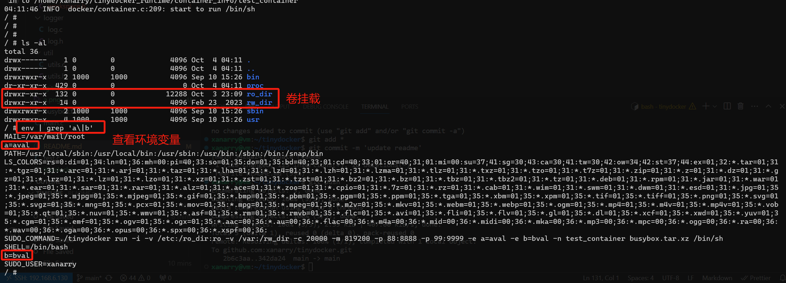

# tinydocker

c语言实现的一个简单docker, 支持cgroup v2, overlayfs, 桥接网络, 端口映射


### 文件说明

```bash
./
├── busybox.tar.xz # 容器运行目录
├── cmdparser # 命令行解析
│   ├── cmdparser.c
│   └── cmdparser.h
├── docker # docker实现代码
│   ├── cgroup.c # cgroup v2支持
│   ├── cgroup.h
│   ├── container.c # 容器核心代码
│   ├── container.h
│   ├── network.c #容器网络支持
│   ├── network.h
│   ├── status_info.c #容器状态信息记录
│   ├── status_info.h
│   ├── volumes.c # 容器卷挂载支持
│   ├── volumes.h
│   ├── workspace.c # 容器工作目录管理
│   └── workspace.h
├── logger 日志库, 这个引用的https://github.com/rxi/log.c
│   ├── log.c
│   └── log.h
├── main.c # 命令行入口
├── makefile
├── README.md
├── test.c # 临时测试使用的代码
└── util  # 一些工具函数
    ├── utils.c
    └── utils.h
```


### 版本特性支持与变化

| git tags | 说明                                                         |
| -------- | ------------------------------------------------------------ |
| v1.0     | Version 1.0, 开启基本的命名空间隔开与容器命令执行            |
| v2.0     | Version 2.0, 添加对容器的cgroup资源限制, 支持cgroup v2, 可以限制cpu和内存 |
| v3.0     | Version 3.0, 支持容器新的设置根目录, 设置方式是将镜像地址填成一个本地目录 |
| v4.0     | Version 4.0, 支持容器overlayfs, 容器里面的变更不再影响挂载的根目录, 支持tar包作为镜像地址(即运行根目录) |
| v5.0     | Version 5.0, 支持卷挂载(支持挂载多个卷, 支持为卷设置只读<br>测试命令: `sudo ./tinydocker run -i -t  -v /host_dir:container_rwdir -v host_dir:container_rodir:ro busybox.tar.xz /bin/sh` |
| v6.0     | Version 6.0, 支持docker commit, 将容器当前工作状态打包到tar文件 |
| v7.0     | Version 7.0, 支持docker ps, 列出运行容器或者全部容器(参数-a) |
| v8.0     | Version 8.0, 支持docker top, 列出容器中的全部进程            |
| v9.0     | Version 9.0, 支持docker exec, 添加进程到容器中运行           |
| v10.0    | Version 10.0, 支持docker stop以及docke rm, 运行前检查容器名是否存在 |
| v11.0    | Version 11.0, docker run, exec支持传入用户环境变量           |
| v12.0    | Version 12.0, 支持容器后台运行以及日志文件输出, tinydocker没有守护进程, 如果后台进程运行完退回了, 状态无法设置到EXITED |
| v13.0    | Version 13.0, 支持桥接网络, 支持命令docker network create    |
| v14.0    | Version 14.0, 支持端口映射                                   |


### 平台要求与依赖

代码在Ubuntu22.04实现, 依赖overlayfs, libcrypto以及tar和brctl工具


### 使用方法

#### 使用说明与下载编译
tinydocker会在*/home/xanarry/tinydocker_runtime*文件夹下创建运行时需要的目录, 编译前需要先创建*/home/xanarry/*, 或者搜索修改代码中的宏定义
```c
#define TINYDOCKER_RUNTIME_DIR "/home/xanarry/tinydocker_runtime"
#define CONTAINER_STATUS_INFO_DIR "/home/xanarry/tinydocker_runtime/container_info"
#define CONTAINER_LOG_DIR "/home/xanarry/tinydocker_runtime/logs"
#define CONTAINER_NETWORKS_FILE "/home/xanarry/tinydocker_runtime/networks"
```

容器运行会在`/home/xanarry/`生成如下目录和文件：
```
./tinydocker_runtime
├── container_info  # 记录容器信息，每个容器对应里面的一个文件
├── containers # 保持容器的挂载信息，比如卷挂载和overlayfs信息
├── images # 容器镜像，一个镜像的tar的hash对应的一个解压后的目录，同一个hash的目录会被多个容器复用，事实上就是overlay fs的只读层
├── logs # 容器后台运行输入出的日志文件
└── networks # 这是一个文件， 记录网络和网络IP地址的分配情况
```

下载编译
```
 git@github.com:xanarry/tinydocker.git # 克隆仓库
 cd tinydocker # 进入仓库目录
 make # 编译名为tinydocker的二进制
```


#### 参数说明

| 参数 | 参数说                                                       |
| ---- | ------------------------------------------------------------ |
| -i   | 使用交互模式, 容器在前台运行                                 |
| -d   | 容器后台运行, 与-i是互斥参数, 不能同时使用                   |
| -v   | 卷挂载, 可以使用多个-v挂载多个卷, 默认读写挂载: `-v host_a:rwa`, 只读挂载: `-v host_b:rwb:ro` |
| -c   | 参数值为整数, 不要设置小于1000, 资源太小会导致容器起不来, cpu分配形式为N/100000, -c参数设置的是N值 |
| -m   | 参数值为整数, 设置内存, 单位是字节（bytes）                  |
| -e   | 设置容器环境变量. 形式: `-e a=b`                             |
| -p   | 设置容器端口映射. 可以使用多个-p映射多个端口. 形式: `-p 80=8080`将容器端口8080映射到宿主机80端口 |
| -n   | 设置容器名字, 如果没有指定, 会使用接受用户命令的时间戳作为容器名 |


#### 使用样例

`sudo ./tinydocker run -i -v /etc:/ro_dir:ro -v /var:/rw_dir -c 20000 -m 819200 -p 88:8888 -p 99:9999 -e a=aval -e b=bval -n test_container busybox.tar.xz /bin/sh`

这个命令使用tinydocker支持的所有特性, 包括卷挂载, 设置容器环境变量, 设置容器CPU/内存资源限制, 设置端口映射, 可以根据实际使用缩减参数

样例参数详细说明:

`-i`: 该命令使用交互模式启动了一个容器

`-n test_container`: 命令容器名为test_container

`busybox.tar.xz`: tinydocker将busybox.tar.xz包解压后的内容作为容器运行根目录

`-v /var:/rw_dir`: 将主机的/var目录读写挂载到容器的/rw_dir目录

`-v /etc:/ro_dir:ro`: 将主机的/etc目录只读挂载到容器的/ro_dir目录

`-c20000`: 设置容器的cpu限制为20000/100000

`-m 819200`: 设置容器的内存现在为819200字节

`-p 88:8888 -p 99:9999`: 分别将容器的8888端口和9999端口映射到主机的88和99端口

`-e a=aval -e b=bval`: 为容器设置a, b两个环境变量, 值分别为aval, bval

`/bin/sh`: 启动容器后运行/bin/sh

运行效果：





### 设计原理与过程
参考文件：docker.md