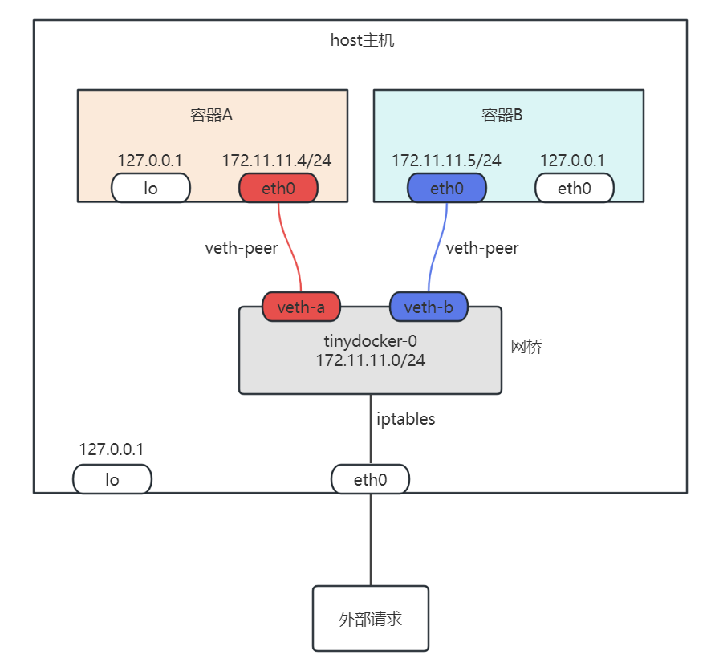

docker容器的本质是一个宿主机上的一个进程，共享宿主机的硬件与内核。在Linux下通过namespace机制，给容器进程不同类型资源一个独立的视图对容器与宿主机做隔离，使得容器进程运行时看起来好像自己是在一个全新的空间下。

关于Linux命名空间，网络操作的介绍本文不再赘述，本文档将着重描写tinydocker的宏观设计以及实现过程中遇到的细节问题。

# 1. 基本的容器与隔离

容器的本质是进程，本节将介绍一个进程如何演变一个容器

下面的代码使用fork启动了一个子进程，并在子进程中运行/bin/bash,只不过这个通过fork产生的子进程继承了父进程的全部上下文信息, 包括命名空间与文件系统, 并且运行的/bin/bash也是来自默认命名空间的而精彩。所以可以理解为这是一个没有开启任何隔离功能的容器，与宿主机共享网络，磁盘，cpu等信息。

```c
#include <stdio.h>
#include <unistd.h>
#include <sys/types.h>
#include <sys/wait.h>

int main() {
    pid_t pid = fork();

    if (pid == -1) {
        perror("fork");
        return 1;
    } else if (pid == 0) {// 子进程
        execl("/bin/bash", "/bin/bash", NULL); //在子进程中运行/bin/bash
        perror("execl");
    } else {// 父进程
        wait(NULL); // 等待子进程结束
        printf("子进程已结束\n");
    }
    return 0;
}
```

因为fork函数默认继承父进程的全部上下文，无法实现资源的隔离，那么使用clone系统调用就能实现对子进程资源更细粒度的控制，下面的clone函数的定义

```c
int clone(int (*fn)(void *), void *stack, int flags, void *arg, .../* pid_t *parent_tid, void *tls, pid_t *child_tid */ );
//fn：子进程运行的函数
//stack：子进程的栈空间大小
//flags：对资源的控制隔离参数
//arg：传入给子进程函数fn的参数
```

flags支持如下参数的组合：

| 宏定义        | 作用             |
| ------------- | ---------------- |
| CLONE_NEWIPC  | 隔离进程间通信   |
| CLONE_NEWNET  | 隔离网络资源     |
| CLONE_NEWNS   | 隔离文件系系统   |
| CLONE_NEWPID  | 隔离进程ID       |
| CLONE_NEWUSER | 隔离用户与用户组 |
| CLONE_NEWUTS  | 主机名与NIS域名  |

那么将这些参数组合就能实现对对应资源的隔离，使得子进程看到不同的视图

```c
#define _GNU_SOURCE
#include <stdio.h>
#include <unistd.h>
#include <sys/types.h>
#include <sys/wait.h>

static char child_stack[8 * 1024 * 1024];
int child_fn(void *args) {
    execl("/bin/bash", "/bin/bash", NULL); //在子进程中运行/bin/bash
}

int main() {
    pid_t child_pid = clone(child_fn, child_stack+(8 * 1024 * 1024), CLONE_NEWUTS | CLONE_NEWPID | CLONE_NEWNS | CLONE_NEWNET | CLONE_NEWIPC | SIGCHLD, NULL);
    if (child_pid == -1) {
        perror("clone subprocess error");
    }
    wait(NULL); // 等待子进程结束
    printf("子进程已结束\n");
    return 0;
}
```

编译并运行上述代码

```bash
xanarry@vm:~/tinydocker$ gcc test.c && sudo ./a.out
root@vm:/home/xanarry/tinydocker# echo $$ # 这里可以看出进程ID已经被隔离
1
root@vm:/home/xanarry/tinydocker# ifconfig # 看不到任何网络信息，网络已经被隔离
root@vm:/home/xanarry/tinydocker# ls # 文件还是和父进程一样的，因为挂载点被继承了进来
a.out  a.png  b.png  busybox.tar.xz  cmdparser  docker  docker.md  logger  main.c  makefile  README.md  test.c  tinydocker  util
root@vm:/home/xanarry/tinydocker# ps -ef | more # 因为挂载点被进程进来，由于进程信息也是在文件系统proc中，所以这里看到了全部进程
UID          PID    PPID  C STIME TTY          TIME CMD
root           1       0  0 10:20 ?        00:00:28 /sbin/init auto noprompt splash
root           2       0  0 10:20 ?        00:00:00 [kthreadd]
root           3       2  0 10:20 ?        00:00:00 [rcu_gp]
root           4       2  0 10:20 ?        00:00:00 [rcu_par_gp]
root           5       2  0 10:20 ?        00:00:00 [slub_flushwq]
root           6       2  0 10:20 ?        00:00:00 [netns]
root           7       2  0 10:20 ?        00:01:24 [kworker/0:0-events]
...这里省略过多的输出
root@vm:/home/xanarry/tinydocker# mount -t proc proc /proc 重新挂载proc后，现在只能看到容器内部的进程
root@vm:/home/xanarry/tinydocker# ps -ef
UID          PID    PPID  C STIME TTY          TIME CMD
root           1       0  0 13:48 pts/6    00:00:00 /bin/bash
root          13       1  0 13:53 pts/6    00:00:00 ps -ef
```

查看上述运行的结果可以看出进程ID，网络都已经被隔离，由于挂载点继承的原因，使用ps看到的还是全部进程，在容器内部使用`mount -t proc proc /proc`重新挂载后再次ps，发现进程信息符合预期，**但是如果退出容器，发现系统运行不了ps，top等命令了，这是由于mount的挂载传播属性导致容器里面对默认命名空间产生了影响**。


那么如何解决这个问题，解决方法就是在容器进程启动之前修改跟挂载点的传播属性，在child_fn函数中添加一行代码` mount(NULL, "/", NULL, MS_REC | MS_PRIVATE, NULL);`，这行代码的以上就是将挂载点`/`以及该挂载点下面的其他挂载点，递归的将其传播属性设置为`MS_PRIVATE`，这样使得继承的挂载点与父挂载点互不影响。

```c
int child_fn(void *args) {
    mount(NULL, "/", NULL, MS_REC | MS_PRIVATE, NULL);
    execl("/bin/bash", "/bin/bash", NULL); //在子进程中运行/bin/bash
}
```

然后在编译运行就能发现挂载点的影响已经不存在。


# 2. 容器资源限制

在有了基本的容器隔离过后，怎么限制容器进程的资源使用呢，此时就需要引入cgroup了，关于group的详细描述与说明可以参考：

https://zorrozou.github.io/docs/%E8%AF%A6%E8%A7%A3Cgroup%20V2.html

https://www.lixueduan.com/posts/docker/07-cgroups-2/

在新版的操作系统中，cgroup都已经是v2版本，因此tinydocker的实现基于v2.


tinydocker参考docker，在`/sys/fs/cgroup/system.slice`文件夹下为每个容器创建一个cgroup目录，目录名形式为`tinydocker-容器名`

1.   针对cpu的限制：在`/sys/fs/cgroup/system.slice/tinydocker-容器名/cpu.max`写入`N 100000`，其中文件内容形式为`$MAX $PERIOD`。对cpu的限制是基于时间片，`$MAX $PERIOD`表示在$PERIOD所表示的时间周期内，给本cgroup分配$MAX
2.   针对mem的限制：在`/sys/fs/cgroup/system.slice/tinydocker-容器名/memory.max`写入`用户设定值字节数`。对内存的限制比较好理解，就是一个具体的字节数

通过文件操作为重启创建对应的cgroup并将cpu和内存的限制写入文件中后，再将容器进程的PID加入到`/sys/fs/cgroup/system.slice/tinydocker-容器名/cgroup.procs`即可实现对进程资源的控制。


这里在代码的具体实现中有一个问题就是需要在有子进程的PID后才能实现对子进程的资源限制，但是默认情况下创建完子进程拿到子进程的PID后，可能还没来得及将该PID加入cgroup，子进程就已经运行起来了，解决方法就是创建完子进程后让子进程阻塞住等待父进程通知，父进程拿到子进程的PID并将PID写入到cgroup.procs后通知子进程开始运行，就避开了这里的时间差问题。

tinydocker使用管道实现对进程启动时序的控制。clone系统调用创建的子进程等待管道的输入，等父进程将准备工作都做好之后，往管道里面写一个字符串通知子进程开始运行。代码如下：

```c
/*头文件*/
int pipe_fd[2]; //无名管道
static char child_stack[8 * 1024 * 1024];

int child_fn(void *args) {
    mount(NULL, "/", NULL, MS_REC | MS_PRIVATE, NULL);

    close(pipe_fd[1]);
    char input_buf[1024] = {0};
    read(pipe_fd[0], input_buf, 1024); //阻塞等待父进程的通知
    close(pipe_fd[0]);

    execl("/bin/bash", "/bin/bash", NULL); //在子进程中运行/bin/bash
}

int main() {
    pipe(pipe_fd);
    pid_t child_pid = clone(child_fn, child_stack+(8 * 1024 * 1024), CLONE_NEWUTS | CLONE_NEWPID | CLONE_NEWNS | CLONE_NEWNET | CLONE_NEWIPC | SIGCHLD, NULL);
    if (child_pid == -1) {
        perror("clone subprocess error");
    }
    
    //设置资源限制
    set_cgroup_limits(child_pid, cpu, mem); //这个函数是对设置cgroup限制的抽象，示例代码中没有具体实现
    
    close(pipe_fd[0]);  //这里的关闭一定要放在创建子进程后面, 如果放在创建子进程前面, 由于继承关系,直接给子进程的读关闭了
    char cmds[] = "start";
    write(pipe_fd[1], cmds, strlen(cmds)) //发送任意字符串，通知子进程开始运行
    close(pipe_fd[1]);

    wait(NULL); // 等待子进程结束
    printf("子进程已结束\n");
    return 0;
}
```


# 3.支持容器镜像

镜像可以简单理解为是一个包括的若干文件的只读目录，通过镜像可让启动后的容器看到的是镜像中指定的文件集合。或者给某个运行的容器创建一个文件快照（docker commit）。

理解容器镜像需要掌握两个依赖知识：

1.   overlay fs：OverlayFS（Overlay File System）是Linux内核中的一种联合文件系统，它允许将多个文件系统层叠在一起，形成一个单一的虚拟文件系统。一般放在下面的多个层（本质也是一个目录）为只读层，在最上面的层为读写层。
2.   pivot_root：该系统调用改变进程所看到的跟文件系统（将指定的目录作为进程所看到的跟文件系统），容器进程起来后，默认看到的是和父进程一样的跟文件系统，通过该系统调用就能修改进程所看到的根目录。

正是上面1和2的组合就实现了容器内独立的文件系统，且将容器的修改限定在了容器内部：**首先通过OverlayFS挂载容器的镜像（包括一系列文件的目录），然后在在这之上设置读写层为容器使用，并将这个overlay文件系统挂载到一个挂载点；最后通过pivot_root将这个挂载点设置为容器的跟目录，就实现了容器的镜像机制**。

通过这个机制可以将容器的镜像作为只读层同时提供给多个容器使用，然后为每个容器添加一个独立的读写层，各个读写层屏蔽了对只读层的修改，使得各个容器之间互不影响。

## 3.1 OverlayFS

这里简单介绍一下overlayfs，overlayfs结构下，包括lowerdir，upperdir，workdir和overlay_dir（挂载点）几个目录。overlayfs是一个层级系统，最下层是lowerdir，lowerdir用来指定只读层，overlayfs的任何修改都不会影响到lowerdir目录中的内容。各个层级说明如下：

| 目录        | 目录说明                                                     |
| ----------- | ------------------------------------------------------------ |
| lowerdir    | 用于指定overlayfs的只读层，可以指定多个目录，**如果多个层中有同名文件，那么放在后面的会覆盖前面的** |
| upperdir    | 用于指定读写层                                               |
| workdir     | overlayfs工作需要的目录                                      |
| overlay_dir | 挂载后用户直接访问文件的挂载点                               |

下面是挂载overlay文件系统的一个命令：

`mount -t overlay overlay -o lowerdir=lower,upperdir=upper,workdir=worker_dir overlay_dir`

该命令设置lower为只读层；设置upper为读写层；最后将overlayfs挂载到overlay_dir目录，用户通过这个目录访问overlayfs。

接下来以busybox为例，看看overlayfs的实际使用效果

```bash
# 创建busybox目录，将busybox.tar.xz解压到busybox作为只读目录
xanarry@vm:~/Documents$ ls
busybox.tar.xz
xanarry@vm:~/Documents$ mkdir busybox
xanarry@vm:~/Documents$ tar -xf busybox.tar.xz -C ./busybox
xanarry@vm:~/Documents$ ls
busybox  busybox.tar.xz
xanarry@vm:~/Documents$ ls busybox #查看busybox目录包括三个目录
bin  sbin  usr

#创建overlayfs需要的目录upper work mountpoint
xanarry@vm:~/Documents$ mkdir upper work mountpoint
#挂载overlayfs到mountpoint目录，需要sudo
xanarry@vm:~/Documents$ sudo mount -t overlay overlay -o lowerdir=busybox,upperdir=upper,workdir=work mountpoint

# 往挂载目录创建和hello文件，可以看出并没有影响只读目录busybox
xanarry@vm:~/Documents$ touch mountpoint/hello
xanarry@vm:~/Documents$ ls -l mountpoint upper busybox
busybox: # busybox还是三个目录
total 12
drwxrwxr-x 2 xanarry xanarry 4096  9月 10 23:26 bin
drwxrwxr-x 2 xanarry xanarry 4096  9月 10 23:26 sbin
drwxrwxr-x 4 xanarry xanarry 4096  9月 10 23:26 usr

mountpoint:
total 12
drwxrwxr-x 2 xanarry xanarry 4096  9月 10 23:26 bin
-rw-rw-r-- 1 xanarry xanarry    0 10月  4 18:00 hello #这里是新建的hello文件
drwxrwxr-x 2 xanarry xanarry 4096  9月 10 23:26 sbin
drwxrwxr-x 4 xanarry xanarry 4096  9月 10 23:26 usr

upper:
total 4
-rw-rw-r-- 1 xanarry xanarry    0 10月  4 18:00 hello #读写目录也能看到hello文件

#接下来删除挂载点的sbin目录和hello文件
xanarry@vm:~/Documents$ rm -rf mountpoint/sbin/ mountpoint/hello
xanarry@vm:~/Documents$ ls -l mountpoint upper busybox
busybox: # busybox依然是三个目录
total 12
drwxrwxr-x 2 xanarry xanarry 4096  9月 10 23:26 bin
drwxrwxr-x 2 xanarry xanarry 4096  9月 10 23:26 sbin
drwxrwxr-x 4 xanarry xanarry 4096  9月 10 23:26 usr

mountpoint: # 可以看出挂载点已经看不到sbin目录和hello文件
total 8
drwxrwxr-x 2 xanarry xanarry 4096  9月 10 23:26 bin
drwxrwxr-x 4 xanarry xanarry 4096  9月 10 23:26 usr

upper:
total 0
c--------- 2 root root 0, 0 10月  4 18:03 sbin #这里可以看出该目录在读写层被设置为字符设备文件标记为删除
```


## 3.2 pivot_root

`pivot_root`是一个Linux系统调用，用于更改系统的根文件系统（root filesystem）。它允许将当前的根文件系统替换为另一个文件系统，同时保持进程的当前工作目录和文件描述符不变。

使用`pivot_root`系统调用可以在运行时切换根文件系统，这在一些特定的场景下非常有用，比如在容器化环境中进行文件系统隔离。

`pivot_root`的使用步骤如下：

1.  准备一个新的文件系统，作为新的根文件系统。
2.  使用`pivot_root`系统调用将当前的根文件系统替换为新的文件系统。这将使新的文件系统成为新的根文件系统，并将旧的根文件系统移动到新的文件系统中的一个目录。
3.  在新的根文件系统中，使用`chdir()`函数切换到新的工作目录，以确保进程的当前工作目录正确。
4.  在新的根文件系统中，使用`umount()`函数卸载旧的根文件系统。
5.  在新的跟文件系统中，删除老的跟文件目录。

以下是一个简单的示例，演示了如何使用`pivot_root`系统调用， 使用中有一些值得注意注意的内容写在了代码的注释中：

```c
/*省略了头文件*/
int pipe_fd[2]; //无名管道
static char child_stack[8 * 1024 * 1024];

//设置容器新的根目录
int set_new_root(char *new_root) {
    /* Ensure that 'new_root' and its parent mount don't have shared propagation (which would cause pivot_root() to
       return an error), and prevent propagation of mount events to the initial mount namespace. 
       保证new_root与它的父挂载点没有共享传播属性, 否则调用pivot_root会报错
       */
    if (mount(NULL, "/", NULL, MS_REC | MS_PRIVATE, NULL) == -1) {
        perror("mount /");  return -1;
    }

    /* 保证'new_root'是一个独立挂载点, 如果有挂载卷在new_root, 这里务必加上MS_REC参数递归挂载挂载的卷目录, 否则容器里面看不到内容*/
    if (mount(new_root, new_root, NULL, MS_REC | MS_BIND, NULL) == -1) {
       perror("mount new_root"); return -1;
    }

    char mkdir_cmd[256] = {0};
    sprintf(mkdir_cmd, "mkdir -p %s/%s", new_root, "old_root");
    system(mkdir_cmd);

    char old_root[256] = {0};
    sprintf(old_root, "%s/%s", new_root, "old_root");
    if (syscall(SYS_pivot_root, new_root, old_root) != 0) {
        perror("SYS_pivot_root"); return -1;
    }

    chdir("/");

    // 卸载老的root
    char old_new[100] = "/old_root";
    if (umount2(old_new, MNT_DETACH) != 0) {
        perror("umount2 old_root"); return -1;
    }
    
    char del_cmd[512] = {0};
    sprintf(del_cmd, "rm -rf %s", old_root);
    return system("rm -rf /old_root");
}

int child_fn(void *args) {
    char *new_root = (char *) args;
    if (set_new_root(new_root) != 0) {
        return -1;
    }

    close(pipe_fd[1]);
    char input_buf[1024] = {0};
    read(pipe_fd[0], input_buf, 1024); //阻塞等待父进程的通知
    close(pipe_fd[0]);

    execl("/bin/sh", "/bin/sh", NULL); //在子进程中运行/bin/sh
}

int main(int argc, char *argv[]) {
    pipe(pipe_fd);
    pid_t child_pid = clone(child_fn, child_stack+(8 * 1024 * 1024), CLONE_NEWUTS | CLONE_NEWPID | CLONE_NEWNS | CLONE_NEWNET | CLONE_NEWIPC | SIGCHLD, argv[1]);
    if (child_pid == -1) {
        perror("clone subprocess error");
    }

    close(pipe_fd[0]);  //这里的关闭一定要放在创建子进程后面, 如果放在创建子进程前面, 由于继承关系,直接给子进程的读关闭了
    char cmds[] = "start";
    write(pipe_fd[1], cmds, strlen(cmds)); //发送任意字符串
    close(pipe_fd[1]);

    wait(NULL); // 等待子进程结束
    printf("子进程已结束\n");
    return 0;
}
```

程序执行过程效果：

```bash
# 先把根目录挂载好
xanarry@vm:~/Documents$ sudo mount -t overlay overlay -o lowerdir=busybox,upperdir=upper,workdir=work mountpoint
xanarry@vm:~/Documents$ ls mountpoint/
bin  sbin  usr

#编译运行修改根目录的程序
xanarry@vm:~/Documents$ gcc test.c
xanarry@vm:~/Documents$ sudo ./a.out /home/xanarry/Documents/mountpoint # 下面就有进入容器的感觉了， 可以看出在根目录ls只有三个目录
/$ ls
bin   sbin  usr
# 下面创建一个test文件，然后删除sbin和usr两个目录
/$ ls -al > ./test
/$ rm -rf sbin usr
/$ ls
bin   test
/$ exit
子进程已结束
xanarry@vm:~/Documents$ ls -l busybox upper mountpoint #查看目录情况
busybox: # 可以看出busybox没有被修改
total 12
drwxrwxr-x 2 xanarry xanarry 4096  9月 10 23:26 bin
drwxrwxr-x 2 xanarry xanarry 4096  9月 10 23:26 sbin
drwxrwxr-x 4 xanarry xanarry 4096  9月 10 23:26 usr

mountpoint: # mountpoint与容器内部看到的一致
total 8
drwxrwxr-x 2 xanarry xanarry 4096  9月 10 23:26 bin
-rw-r--r-- 1 root    root     374 10月  4 19:21 test

upper: # upper目录记录文件的变动情况
total 4
c--------- 3 root root 0, 0 10月  4 19:22 sbin # 被标记删除
-rw-r--r-- 1 root root  374 10月  4 19:21 test # 新建的文件
c--------- 3 root root 0, 0 10月  4 19:22 usr # 被标记删除
```


## 3.3总结

通过3.1和3.2演示的效果可以看出，只需要先将镜像内容以overlayfs的形式挂载到指定挂载点，然后将挂载点设置为容器的根目录即可实现容器镜像的运行效果。


# 4. 支持dockers commit

docker commit的作用是将当前运行的容器状态打包记录下来，其背后逻辑也比较简单：找到容器overlayfs挂载点对应的目录，将该目录使用tar打包到命令指定的文件中即可。

下面是tinydocker的具体实现代码：

```c
int docker_commit(struct docker_commit_arguments *args) {
    // 检查容器对应的挂载点是否存在
    char container_mountpoint[512] = {0};
    sprintf(container_mountpoint, "%s/containers/%s/mountpoint", TINYDOCKER_RUNTIME_DIR, args->container_name);
    if (path_exist(container_mountpoint) == 0) {
        log_error("container is not exists: %s", args->container_name);
        return -1;
    }
    
    char tar_path[512] ={0};
    if (args->tar_path == NULL) { //构造目标tar文件路径
        sprintf(tar_path, "%s.tar", args->container_name);
        args->tar_path = tar_path;
    }
    
	//打包容器根目录挂载点到指定tar文件
    if (create_tar(container_mountpoint, args->tar_path) != 0) {
        log_error("failed to commit container: %s", args->container_name);
        return -1;
    }

    return 0;
}
```


# 5. 支持docker ps

tinydocker的容器状态有RUNNING，EXITED，STOPED三种，每个容器的信息被记录在CONTAINER_STATUS_INFO_DIR目录中，一个容器一个文件。docker ps列出所有的容器，实际上也就是读取CONTAINER_STATUS_INFO_DIR这个目录中的全部文件，让后这些信息组织输出到终端。


## 5.1 容器状态信息

容器状态文件头对应的结构体如下：

```c
struct container_info {
    int pid; //容器进程ID;
    int detach; //是否后台运行
    char container_id[128]; //容器ID
    char image[128]; //容器镜像
    char command[512]; //容器运行的命令
    char created[20]; //容器创建时间
    char status[10]; //容器状态
    char name[128]; //容器名字
    char ip_addr[16]; //容器分配的IP, 用于回收地址
    int volume_cnt; //卷挂载数量
    char volumes[32][512]; //卷挂载信息, 假定最多挂载32个卷, 卷配置host:container:ro长度不超过512
};
```


## 5.2 三种状态的描述

| 状态    | 状态描述以产生的时机                                         |
| ------- | ------------------------------------------------------------ |
| RUNNING | docker run的时候会创建一个容器的状态文件，初始化状态就是RUNNING |
| EXITED  | 如果是交互程序，容器退出，父进程收到容器1号进程退出的信号后，会将容器的状态修改为EXITED |
| STOPED  | 容器被docker stop终止掉                                      |


## 5.3 tinydocker状态描述存在的缺陷

由于tinydocker没有daemon程序，在下面这些情况下会导致容器的状态永远处于RUNNING状态

1.   容器后台运行一段时间正常推出，比如后台sleep 200秒。这种情况没有守护进程监听和处理容器退出的情况，导致exit后还是RUNNING
2.   有容器在运行，但是操作系统直接关机，进程被杀死的情况tinydocker也没发感知到然后修改状态。


# 6. 支持docker exec

`docker exec -d|it container_name binary` 命令在容器container_name中以交互形式或者后台运binary程序。

前面说过容器的本质还是进程，只不过给相关的进程设置了特定的namespace使得容器内像是一个独立的空间一样，那么要实现docker exec只需要：

1.   将需要exec的程序加入容器1号进程的同一个命名空间记录，包括net, pid, ipc等。
2.   将exec的程序加入容器1号进程所在的cgroup才能实现对资源的限制。


## 6.1 实现代码

下面是tinydocker的exec实现，这是一个比docker run还复杂的函数。

```c
int docker_exec(struct docker_exec_arguments *args) {
    int current_pid = getpid();
    // 获取当前进程的cgroup路径， 用户还原父进程的cgroup, 否则当前运行进程也加入到了容器内部的cgroup
    char *cgroup_files[64];
    int cgroup_file_cnt = get_cgroup_files(current_pid, cgroup_files, 64);
    if (cgroup_file_cnt < 0) {
        log_error("failed to get current prcess cgroup, pid=%d", current_pid);
        exit(-1);
    }

    //启动第一个进程用来在启动用户程序后户还原当前exec进程本身的cgroup
    int pipe_fd[2];
    pipe(pipe_fd);
    int pid = fork();
    if (pid < 0) {
        exit(-1);
    } else if (pid == 0) {
        close(pipe_fd[1]);
        char read_buf[128] = {0};
        int len = read(pipe_fd[0], read_buf, 128); //如果父进程处理遇到错误会直接退出关闭管道，然后这里读的数据就是0，需要特殊处理
        log_info("cgroup help prcess get message: %s, message_len: %d", read_buf, len);
        //移除父进程的cgroup
        if (len > 0) {
            if (write_pid_to_cgroup_procs(current_pid, "/sys/fs/cgroup/user.slice/user-1000.slice/session-2.scope/cgroup.procs") == -1) {
                log_error("failed to moved out docker exec pid %d from new cgroup setting", current_pid);
            } else {
                log_info("docker exec pid %d moved out from new cgroup setting", current_pid);
            }
        }
        log_info("parrent process exit, exit myself, pid=%d", current_pid);
        exit(0);
    }

    // 先设置cgroup好让子进程继承, 不然在绑定了命名空间后会提示找不到cgroup文件
    if (apply_cgroup_limit_to_pid(args->container_name, current_pid) == -1) {
        log_error("failed to set cgroup limits");
        exit(-1);
    }

    // 找出目标容器中的一个进程ID, 该进程用来寻找ns文件
    int pid_list[4096];
    int pid_cnt = get_container_processes_id(args->container_name, pid_list);
    if (pid_cnt <= 0) {
        log_error("failed to get container process list");
        return -1;
    }
    //默认第一个进程为1号进程, 可能不准, 但是在我们这个简单环境下基本都是它了
    int one_pid = pid_list[0];

    // 记录容器1号进程的环境变量
    char **envs = load_process_env(one_pid, args->env, args->env_cnt);

    //设置当前主进程的命名空间    
    //CLONE_NEWUTS | CLONE_NEWPID | CLONE_NEWNS | CLONE_NEWNET | CLONE_NEWIPC
    char ns_file[1024];
    char *ns_typs[] = {"ipc", "uts", "net", "pid", "mnt", NULL}; 
    for (int i = 0; ns_typs[i] != NULL; i++) {
        // /proc/25032/ns/
        strcpy(ns_file, ""); //清空字符串
        sprintf(ns_file, "/proc/%d/ns/%s", one_pid, ns_typs[i]);
        int fd = open(ns_file, O_RDONLY | O_CLOEXEC);
        if (fd == -1 || setns(fd, 0) == -1) { // Join that namespace 
            log_error("failed to join current process to destinct %s ns", ns_typs[i]);
            exit(-1);
        }
        close(fd);
    }
    
    // 创建一个子进程运行用户程序
    pid = fork();
    if (pid < 0) {
        log_error("failed to create subprocess");
        exit(1);
    } else if (pid == 0) { //子进程
        printf("run %s\n", args->container_argv[0]);
        if (execve(args->container_argv[0], args->container_argv, envs) == -1) {  //Execute a command in namespace 
            log_error("failed to run cmd: %s", args->container_argv[0]);
        }
        exit(0);
    } else { // 父进程
        close(pipe_fd[0]);
        char buf[100] = "remove_crgroup";
        write(pipe_fd[1], buf, strlen(buf));
        close(pipe_fd[1]);

        if (args->detach == 0) {
            log_info("docker exec waiting user command to finish now, user cmd pid=%d", pid);
            waitpid(pid, NULL, 0);  // 等待子进程结束
        }
        log_info("docker exec finished");
    }

    return 0;
}
```


## 6.2 exec流程概述

docker exec的实现包括下面几个步骤：

1.   记录当前tinydocker这进程所在的cgroup
2.   启动第一个子进程等待tinydocker进程的信号，用户恢复tinydocker到原来的cgroup
3.   将当前tinydocker进程加入到目标容器的cgroup，方便启动的子进程直接继承过去
4.   找出目标容器1号进程在默认命名空间对应的进程PID
5.   分别读取文件`/proc/[PID]/ns/[ipc|uts|net|pid|mnt]`，并执行函数`setns(fd, 0)`将当前tinydocker加入到容器进程的命名空间
6.   创建子进程运行目标binary程序，子进程继承了父进程的命名空间，就进入了容器内
7.   给第一个子进程发送信号，让他将当前tinydocker进程移除到原来默认的cgroup
8.   如果是-d参数，当前tinydocker进程直接退出，否则等待binary子进程结束。


## 6.3 两个问题

为什么上面的步骤需要专门用一个进程来恢复tinydocker进程本身的cgroup？

**因为tinydocker进程在运行过程中会加入与容器一样的命名空间，加入mnt空间后会导致原来cgroup文件访问不到，所以就先把原来的cgroup记录下来，等tinydocker进程启动binary程序后再用来恢复，否则tinydocker进程本身也加入了容器进程的cgroup，这是不符合预期的。**


既然修改了tinydocker进程本身使用setns进入了与容器一样的命名空间，为什么容器内部`ps -ef`查看不到tinydocker进程而只看得到binary进程？

**因为tinydocker是在默认命名空间启动的，进程起来后就有了特定的PID，这个时候修改命名空间也不会导致原来的进程PID进入新的容器的PID命名空间，所容器内看不到tinydocker进程；但是binary是修改命名空间后创建的，PID就和容器在同一个PID命名空间了**


# 7. 支持docker top

tinydocker为每个容器都设置了cgroup，路径为`/sys/fs/cgroup/system.slice/tinydocker-容器名`, 且无论是容器内部1号进程产生的子进程还是tinydocker exec创建的进程，都会加入到目标容器的cgroup中，因此只要找到容器1号进程对应的cgroup，然后读取cgroup.procs中的进程ID列表，最后调用系统命令`ps -f -p pid1 pid2 pi3 ...`即可输出进程信息。

下面是`ps -f -p ...`输出的效果：

```ba
xanarry@vm:~/tinydocker$ ps -f -p 1 2 3 4
UID          PID    PPID  C STIME TTY      STAT   TIME CMD
root           1       0  0 11:17 ?        Ss     0:33 /sbin/init auto noprompt splash
root           2       0  0 11:17 ?        S      0:00 [kthreadd]
root           3       2  0 11:17 ?        I<     0:00 [rcu_gp]
root           4       2  0 11:17 ?        I<     0:00 [rcu_par_gp]
```


# 8. 支持docker stop

docker stop分为如下4个步骤:

1. 拿到目标容器的全部进程ID，方法与docker top一样，通过cgroup拿
2. 对所有进程发送SIGTERM信号，好让进程能自己处理后事
3. 为了避免有的进程不自己退出或者忽略了SIGTERM信号，等10秒（默认时间，可以通过命令行指定具体的值）后再发送SIGKILL信号
4. 最后更新相关容器的装完STOPED


# 9. 支持docker rm

docker rm用于删除容器的各种工作目录以及网络配置和IP分配信息。

具体包括以下信息：

1.   cgroup文件

2.   卸载挂载的卷

3.   卸载overlayfs挂载工作目录

4.   删除容器工作所生成的全部目录

5.   释放占用的IP地址

6.   删除端口映射规则

7.   删除状态文件

     

tinydocker rm将执行如下函数：

```c
void clean_container_runtime(char *container_name) {
    if (!container_exists(container_name)) {
        return;
    }
    //删除cgroup文件
    if (remove_cgroup(container_name) != 0) {
        log_error("failed remove cgroup: %s", container_name);
        perror("failed remove cgroup");
    }
    log_info("finish clean cgroup %s", container_name);

    //构造挂载点
    char mountpoint[1024] = {0};
    sprintf(mountpoint, "%s/containers/%s/mountpoint", TINYDOCKER_RUNTIME_DIR, container_name);

    //umount 挂载的卷
    struct container_info info;
    read_container_info(container_name, &info);
    struct volume_config *volumes = (struct volume_config *) malloc(sizeof(struct volume_config));
    for (int i = 0; i < info.volume_cnt; i++) { // 解析出挂载的卷列表
        volumes[i] = parse_volume_config(info.volumes[i]);
    }
    umount_volumes(mountpoint, info.volume_cnt, volumes);
    free(volumes);
    log_info("finish unmount mounted volumes");

    //umount 容器跟目录挂载点
    umount(mountpoint);
    log_info("finish unmount container mountpoint %s", mountpoint);

    //清理容器工作目录
    char container_dir[256] = {0};
    sprintf(container_dir, "%s/containers/%s", TINYDOCKER_RUNTIME_DIR, container_name);
    if (remove_dir(container_dir) == -1) {
        log_error("clean container %s work dir error", container_dir);
    }
    log_info("finish clean container dir: %s", container_dir);

    //释放占用的IP地址
    release_used_ip(TINYDOCKER_DEFAULT_NETWORK_NAME, info.ip_addr);

    //删除端口映射规则
    unset_container_port_map(info.ip_addr);

     // 删除状态文件
    remove_status_info(container_name);
}
```


# 10. 支持为容器传入环境变量

容器的环境变量来自两个地方：

1.   父进程的环境变量
2.   用户通过-e参数自定义环境变量

那么只需将这两种环境变量组合到一起，让后通过`execve()`函数传入即可。


那么如果拿到父进程的环境变量呢， 有以下两种方法：

1.   通过全局变量extern char **environ。该方法可以在docker run的时候直接使用
2.   读取`/proc/[pid]/environ`文件。该方法既可以用在docker run也可以用在docker exec，且docker exec只能使用这个方法，因为需要根据容器1号进程拿环境变量。


`extern char **environ`变量是一个k=v形式的字符串；`/proc/[pid]/environ`文件是一个以`k1=v1\0k2=v2`形式保存的文本文件。所以主要是处理`/proc/[pid]/environ`文件，需要读出来按`\0`分割存放到数组。

下面是获取环境变量的函数实现：

```c
extern char **environ;

char **load_process_env(int pid, struct key_val_pair *user_envs, int user_env_cnt) {
    const int max_env_cnt = 256 + 1; //多一个放空指针
    char **envs = (char **) malloc(sizeof(char *) * max_env_cnt); //最多支持max_env_cnt个环境变量
    int env_idx = 0;

    // 复制父进程的环境变量
    if (getpid() == pid) {  //获取当前进程自己的环境变量, 直接使用environ变量
        for (int i = 0; env_idx < max_env_cnt && environ[i] != NULL; i++) {
            envs[env_idx++] = environ[i];
        }
    } else {
        char path[256];
        sprintf(path, "/proc/%d/environ", pid);
        int fd = open(path, O_RDONLY);
        if (fd < 0) {
            log_error("failed to open environ file: %s, err:%s", path, strerror(errno));
            return 0;
        }

        int buf_size = 4096;
        char buffer[buf_size];
        int len = 0;
        char kv_line[buf_size];
        int kv_idx = 0;
        while ((len = read(fd, buffer, buf_size)) > 0) {
            for (int i = 0; i < len; i++) {
                if (buffer[i] == '\0') { // envion文件形式为k1=v1\0k2=v2\0, 且一定有\0结尾, 所以这里能访问所有变量
                    char *kv_pair = (char *) malloc(kv_idx + 2);
                    strcpy(kv_pair, kv_line);
                    envs[env_idx++] = kv_pair;
                    memset(kv_line, 0, buf_size);
                    kv_idx = 0;
                } else {
                    kv_line[kv_idx++] = buffer[i];
                }
            }
            memset(buffer, 0, buf_size);
        }
        close(fd);
    }

    // 复制用户设置的环境变量
    for (int i = 0; env_idx < max_env_cnt && i < user_env_cnt; i++) {
        char *key = user_envs[i].key;
        char *val = user_envs[i].val;
        char *env_kv = (char *) malloc(10 + strlen(key) + strlen(val));
        strcpy(env_kv, "");
        sprintf(env_kv, "%s=%s", key, val);
        envs[env_idx++] = env_kv;
    }
    envs[env_idx] = NULL;

    return envs;
}
```


# 11. 容器后台运行与日志输出

如何实现后台运行：tinydocker进程创建容器进程后直接退出，不等待即可

如何实现容器日志：tinydocker启动子进程后，将子进程的标准错误和标准输出都重定向到指定文件

日志文件需要在子进程函数中加入如下代码：

```c
//如果容器是后台运行, 将日志日志重定向到指定目录
if (run_args->detach) {
    char log_file_path[128] = {0};
    sprintf(log_file_path, "%s/%s", CONTAINER_LOG_DIR, run_args->name);
    log_info("container log file: %s", log_file_path);
    int fd = open(log_file_path, O_WRONLY | O_CREAT | O_TRUNC | O_SYNC, 0644); // 开启O_SYNC标志, 不要使用缓存
    if (fd < 0) {
        log_error("failed to open container log file: %s", log_file_path);
    }
    dup2(fd, 1);
    dup2(fd, 2);
}
```


# 12. 支持容器桥接网络

Docker默认支持以下几种网络：

1.  桥接网络（Bridge Network）：这是Docker默认创建的网络类型。它使用Docker守护进程上的桥接网络驱动程序，为容器分配IP地址，并通过主机上的网络接口与外部网络通信。桥接网络允许容器之间和容器与主机之间进行通信。
2.  主机网络（Host Network）：使用主机网络模式时，容器与主机共享网络命名空间，即容器使用主机的网络栈。这意味着容器可以直接使用主机的网络接口，与主机上的其他服务进行通信，而不需要进行端口映射。
3.  网络连接（Container Network）：容器可以连接到其他容器创建的网络，以实现容器之间的通信。这种网络连接可以通过Docker命令行工具或Docker Compose进行配置。
4.  无网络（None Network）：在无网络模式下，容器没有网络连接。这对于某些特殊情况下的容器使用是有用的，例如只需要在容器内部运行一些计算任务而不需要网络连接。


**上面四种其中Host Network就是不为容器设置独立的net命名空间；None Network就是设置独立的net命名空间，但是不做任何网络配置。**


tinydocker只支持桥接网络，关于桥接网络可以参考文档：https://zhuanlan.zhihu.com/p/558785823

也可以通过如下Linux命令模拟出来：

```bash
# destroy everything 
sudo ip link delete eth0a ; sudo ip link delete eth0b ;  sudo ip link delete br0 ; sudo ip link delete vetha ; sudo ip link delete vethb 

# create namespaces 
ip netns del neta ; ip netns del netb ; ip netns add neta  && sudo ip netns add netb && ip netns list

# create veth pairs and bridge 
ip link add eth0a type veth peer name vetha && ip link add eth0b type veth peer name vethb && ip link add br0 type bridge

# add devices to network namespace 
ip link set eth0a netns neta && ip link set eth0b netns netb

# add second peers into bridge 
ip link set vetha master br0 && ip link set vethb master br0

# add addresses 
ip a add 172.10.1.4/24 dev br0 && ip netns exec neta ip a add 172.10.1.5/24 dev eth0a  && ip netns exec netb ip a add 172.10.1.6/24 dev eth0b

# bring up all devices 
ip netns exec neta ip link set eth0a up && ip netns exec netb ip link set eth0b up && ip link set vetha up && ip link set vethb up && ip link set br0 up

# ping一下看看是否通畅
ip netns exec neta ping 172.10.1.6 -I i0
```


tinydocker的桥接网络形式如下图所示



每次执行tinydocker命令的时候，tinydocker都会检查是否存在默认的网桥tinydocker-0，如果不存在就创建一个网桥，并设置其网络为172.11.11.0/24


## 12.1 创建网桥

基本就是调用系统命令，该函数传入一个网桥名name，cidr网络，以及driver名字，这里driver名字没有使用，支支持bridge。

首先检查目标网桥是否存在，就是执行一下`brctl show | grep name`检查是否存在。

然后创建网桥并写入网桥信息到文件

最后为网桥设置IP并启动网桥。

```c
int create_network(char *name, char *cidr_network, char *driver) {
    // 暂时只支持网桥
    if (strcmp(driver, "bridge") != 0) {
        return -1;
    }

    //如果已经存在该网络
    if (net_has_exist(name)) {
        log_error("network %s has exists");
        return -1;
    }

    struct network nw = {
        .name = name,
        .driver = driver,
        .cidr = cidr_network,
        .used_ips = NULL,
        .used_ip_cnt = 0
    };

    //创建网桥
    char bradd_cmd[128] = {0};
    sprintf(bradd_cmd, "if ! brctl show | grep -q \"^%s\"; then brctl addbr \"%s\"; fi", name, name);
    if (system(bradd_cmd) != 0) {
        log_error("failed create new bridge for %s", name);
        return -1;
    }

    //写入网络信息
    if (write_network_info(nw) == -1) {
        log_error("failed to save network info: %s", name);
        return -1;
    }

    //为网桥设置IP地址
    char firs_cidr_ip[32] = {0};
    get_first_cidr_host_ip(cidr_network, firs_cidr_ip, 32);
    char set_ip_cmd[128] = {0};
    sprintf(set_ip_cmd, "ip addr add %s dev %s", firs_cidr_ip, name); //这里使用cidr地址

    char start_up[128] = {0};
    sprintf(start_up, "ip link set %s up", name);

    char *cmds[] = {set_ip_cmd, start_up, NULL};
    for (int i = 0; cmds[i] != NULL; i++) {
        if(system(cmds[i]) != 0) {
            log_warn("faild to run %s", cmds[i]);
        }
    }
    return 0;
}
```


## 12.2 容器链接到网桥

容器链接到网桥的本质是为容器创建一个veth peer，然后一端连接到网桥tinydocker-0上，一端连接到容器内。

连接流程如下：

1.   为容器在目标网络申请一个新的IP，每个网络使用了的IP记录在CONTAINER_NETWORKS_FILE这个文件中，IP申请的方法就是算出这个cidr网络的最大与最小IP地址范围，然后遍历这些地址，只要是没有被记录使用的就返回。
2.   找出容器1号进程ID，用来将veth peer的一个节点放入目标容中去。
3.   创建一对veth peer，一个放入容器，一个链接到网桥tinydocker-0上
4.   为容器中的veth节点设置IP地址，并设置为启用
5.   为容器启动lo回环地址
6.   将容器的默认路径设置为网桥tinydocker-0的地址

```c
int connect_container(char *container_name, char *network, char *ip_addr) {
    //为容器申请新的IP
    char str_ip[64] = {0}; //返回0表示没有申请到有效的IP
    if (alloc_new_ip(network, str_ip, 64) == 0) {
        log_error("failed alloc new ip for container: %s", container_name);
        return -1;
    }
    
    // 找出目标容器中的一个进程ID, 该进程用来寻找ns文件
    int pid_list[4096];
    int pid_cnt = get_container_processes_id(container_name, pid_list);
    if (pid_cnt <= 0) {
        log_error("failed to get container process list");
        return -1;
    }
    //默认第一个进程为1号进程, 可能不准, 但是在我们这个简单环境下基本都是它了
    int one_pid = pid_list[0];


    //生成veth的名字
    char *veth_container = "eth0";
    char veth_host[20] = {0};
    snprintf(veth_host, 16, "%s-%s", "tdbr", container_name); //veth名字长度显示是16

    //创建veth peer
    char add_veth_peer[128] = {0};
    sprintf(add_veth_peer, "ip link add %s type veth peer name %s", veth_container, veth_host);

    //将veth一端连接到网桥
    char brctl_addif[128] = {0};
    sprintf(brctl_addif, "brctl addif %s %s", network, veth_host);
    //并启动网桥端的veth
    char set_host_peer_up[128] = {0};
    sprintf(set_host_peer_up, "ip link set %s up", veth_host);

    //将veth的另一端放入容器中
    char set_veth_container_into_container[128] = {0};
    sprintf(set_veth_container_into_container, "ip link set dev %s netns %d", veth_container, one_pid);

    //设置容器回环地址
    char add_loif[128];
    sprintf(add_loif, "nsenter -t %d -n ip addr add 127.0.0.1/8 dev lo", one_pid);
    char set_loifup[128];
    sprintf(set_loifup, "nsenter -t %d -n ip link set lo up", one_pid);


    //设置容器网桥地址
    char add_container_addr[128];
    sprintf(add_container_addr, "nsenter -t %d -n ip addr add %s/24 dev %s", one_pid, str_ip, veth_container);
    char set_container_ifup[128];
    sprintf(set_container_ifup, "nsenter -t %d -n ip link set %s up", one_pid, veth_container);


    //设置容器路由
    char set_route[128] = {0};
    sprintf(set_route, "nsenter -t %d -n ip route add default via %s dev eth0", one_pid, TINYDOCKER_DEFAULT_GATEWAY);
        
    //开始执行上述命令
    char *cmds[] = {add_veth_peer, brctl_addif, set_host_peer_up, set_veth_container_into_container, \
                    add_loif, set_loifup, add_container_addr, set_container_ifup, set_route, NULL};

    for (int i = 0; cmds[i] != NULL; i++) {
        if (system(cmds[i]) != 0) {
            log_error("failed run: %s", cmds[i]);
            return -1; 	
        }
    }

    strcpy(ip_addr, str_ip);
    return 0;
}
```


## 12.3 配置地址转换

通过前面两小节的配置，容器之间能够相互ping通，但是容器内部还无法ping通外部地址，是因为来之容器内部的请求源IP是容器的地址，请求发送出去之后，外部系统无法回报，导致无法ping通。

因此需要配置iptables规则做地址转换：

`iptables -t nat -A POSTROUTING -o $TINYDOCKER_DEFAULT_NETWORK_CIDR -j MASQUERADE`

这个命令的`-j MASQUERADE`选项会动态地将数据包的源IP地址修改为出口网络接口的IP地址，并在返回的数据包中将目标IP地址修改回原始的源IP地址。这样，外部网络就无法直接访问内部网络中的主机，而是通过出口网络接口进行通信。


该代码添加到初始化docker的函数中

```c
int init_docker_env() {
    int r = create_default_bridge();
    if (r != 0) {
        log_error("failed to create detault net bridge");
        exit(-1);
    }

    //添加iptables支持外部响应可以返回到容器内部
    char iptable_rule[129] = {0}; //创建IP规则
    sprintf(iptable_rule, "-t nat -A POSTROUTING -s %s -j MASQUERADE", TINYDOCKER_DEFAULT_NETWORK_CIDR);
    char bash_script[1024] = {0}; //检查规则是否已经存在, 如果规则不存在，添加它
    sprintf(bash_script, "if ! iptables -C %s 2>/dev/null; then iptables %s; fi", iptable_rule, iptable_rule);
    system(bash_script);
    return 0;
}
```

通过上面的配置，就能实现容器之间以及容器与外部的相互通信。


# 13. 支持容器端口映射

端口映射由iptables支持。

为每个端口添加两条iptable规则即可：

`iptable -t nat -A OUTPUT -p tcp -dport 主机端口 -j DNAT --to-distination 容器IP:容器端口`：用于host主机内部访问容器，因为内部请求不会走PREROUTING，所有需要配置一条output规则。

`iptables -t nat -A PREROUTING -p tcp -m tcp -dport 主机端口 -j DNAT --to-distination 容器IP:容器端口`：用于host主机外部访问容器

## 13.1添加容器端口映射

```c
void set_container_port_map(char *container_ip, int port_cnt, struct port_map *port_maps) {
    for (int i = 0; i < port_cnt; i++) {
        int host_port = port_maps[i].host_port;
        int container_port = port_maps[i].container_port;

        char output_dnat[128] = {0}; //用户本机访问容器的端口转发, 因为PREROUTING只对来自宿主机外部请求起作用
        sprintf(output_dnat, "iptables -t nat -A OUTPUT -p tcp --dport %d -j DNAT --to-destination %s:%d", host_port, container_ip, container_port);
        char prerouting_dnat[128] = {0}; //用户外部机器访问host主机时的端口转发
        sprintf(prerouting_dnat, "iptables -t nat -A PREROUTING -p tcp -m tcp --dport %d -j DNAT --to-destination %s:%d", host_port, container_ip, container_port);
       
        char *cmds[] = {output_dnat, prerouting_dnat, NULL};
        for (int i = 0; cmds[i] != NULL; i++) {
            int ret = system(cmds[i]);
            if (ret != 0) {
                log_error("failed to run %s, ret:%d", cmds[i], ret);
            }
        }
        log_info("set host port %d map to container port %d successful", host_port, container_port);
    }
}
```


## 13.2 移除端口映射

同样是执行linux命令，在容器退出的时候，根据容器IP grep匹配上的iptables规则，然后删除即可。

```c
void unset_container_port_map(char *container_ip) {
    char pattern[64] = {0};
    sprintf(pattern, "DNAT --to-destination %s", container_ip);
    char bash_script[1024] = {0};
    sprintf(bash_script, "iptables -t nat -S | grep '%s' | while IFS= read -r rule; do iptables -t nat -D ${rule#\"-A\"}; done", pattern);
    int ret = system(bash_script);
    if (ret == 0) {
        log_info("unset  container port map for container ip %s successful", container_ip);
    } else {
        log_info("unset  container port map for container ip %s ret:%d", container_ip, ret);
    }
}
```

